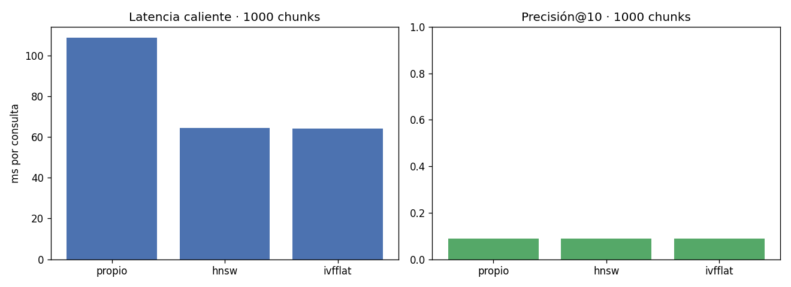

# Sistema Multimodal de Recuperación y Búsqueda

**Curso:** Base de Datos 2 — UTEC 2026-1
**Opción implementada:** Búsqueda Multimodal en Documentos (Texto + Imagen)
**Dataset:** [BBC News RSS Feeds — Kaggle (gpreda)](https://www.kaggle.com/datasets/gpreda/bbc-news)

Sistema de recuperación de información que indexa artículos de BBC News combinando dos modalidades y
permite buscar por consulta textual, por imagen, o por una fusión de ambas:

- **Texto:** split por párrafos → TF-IDF → codebook lingüístico (top-k) → índice invertido con **SPIMI**.
- **Imagen:** patches → **SIFT** → codebook visual (**K-Means**, BoVW) → índice invertido por histogramas.

Ambas modalidades comparten el mismo modelo de espacio vectorial (ranking por similitud de coseno) y se
cruzan por `doc_id`, que une el texto y la imagen de un mismo artículo.

---

## Contenido

1. [Arquitectura del sistema](#1-arquitectura-del-sistema)
2. [Dataset y características](#2-dataset-y-características)
3. [Detalles de implementación por módulo](#3-detalles-de-implementación-por-módulo)
4. [Evaluación experimental (Fase 4)](#4-evaluación-experimental-fase-4)
5. [Resultados y análisis de trade-offs](#5-resultados-y-análisis-de-trade-offs)
6. [Instalación y uso](#6-instalación-y-uso)
7. [Estructura del repositorio](#7-estructura-del-repositorio)

---

## 1. Arquitectura del sistema

El sistema separa la **generación de datos** (scraping + indexado, tarea del maintainer) de la
**consulta** (API + frontend, lo que usa el cliente). Ambas modalidades siguen el mismo flujo de
recuperación por ranking (Ranked Retrieval) y se persisten en PostgreSQL.

```
                 ┌────────────────────── INDEXADO (offline) ──────────────────────┐
  BBC News  ──▶  scrape ──▶ split ──▶ extractor ──▶ codebook ──▶ índice invertido ──▶ PostgreSQL
  (Kaggle)        HTML     párrafos    TF-IDF        top-k          SPIMI               (+ pgvector)
                          / patches    / SIFT      / K-Means      / histogramas
                                                                                             │
                 ┌────────────────────── CONSULTA (online) ───────────────────────┐         │
  query text ─┐                                                                    ▼         │
  query image ┼─▶ FastAPI ──▶ vector TF-IDF de la consulta ──▶ cruce de posting lists ──▶ coseno ──▶ top-N
  alpha ──────┘                (texto y/o imagen)                (índice invertido)      ranking
```

- **Modelo común:** cada *chunk* (párrafo de texto o patch de imagen) es un "documento" del espacio
  vectorial; el peso es TF-IDF y el ranking es por similitud de coseno con la consulta.
- **Fusión multimodal:** los scores de texto e imagen se normalizan a `[0,1]` y se combinan con
  `score = alpha · texto + (1 − alpha) · imagen`.
- **Persistencia:** PostgreSQL 16 con la extensión **pgvector**; el índice invertido propio vive en
  tablas de posting lists y pgvector almacena los histogramas densos para los baselines de la evaluación.

### Mapeo al checklist del proyecto

| Requisito | Modalidad | Implementación |
|-----------|-----------|----------------|
| Split | Texto / Imagen | `src/indexing/text/split.py` (párrafos) · `src/indexing/image/split.py` (patches 4×4) |
| Extractor | Texto / Imagen | TF-IDF en `src/indexing/text/extractor.py` · SIFT en `src/indexing/image/extractor.py` |
| Codebook | Texto / Imagen | top-k lingüístico en `src/indexing/text/codebook.py` · K-Means en `src/indexing/image/codebook.py` |
| Índice invertido | Texto / Imagen | **SPIMI** en `src/indexing/text/spimi.py` · histogramas en `src/indexing/image/index.py` |
| Persistencia | Compartida | PostgreSQL + pgvector (`db/schema.sql`): codebooks, histogramas, índices y metadatos |
| Búsqueda | Texto / Imagen | coseno en `src/indexing/{text,image}/search.py`; fusión en `src/api/main.py` |
| Evaluación | Texto / Imagen | `eval/`: propio vs GIN/GiST (texto) y vs pgvector (imagen) |

---

## 2. Dataset y características

**Fuente:** [BBC News RSS Feeds (Kaggle, gpreda)](https://www.kaggle.com/datasets/gpreda/bbc-news) —
`data/bbc_news.csv`, con 42.329 entradas (`title`, `pubDate`, `guid`, `link`, `description`).

A partir de ese feed, el pipeline genera dos vistas del dataset:

| Vista | Origen | Contenido | Uso |
|-------|--------|-----------|-----|
| **Demo curada** | `pipeline/scrape_text.py` → `data/articulos.csv` | Artículos con **body completo** scrapeado del HTML (título, descripción, cuerpo por párrafos, categoría de `article:section`, `og:image`) | App y dump de arranque |
| **Corpus de evaluación** | scrape completo (o `eval/build_eval_corpus.py` como respaldo) | Hasta decenas de miles de chunks de texto para medir el escalado 1K/10K/20K | Fase 4 |

**Características del texto:**

- **Chunk = párrafo** (mínimo 30 palabras, para descartar ruido).
- **Codebook lingüístico:** top **K = 5000** términos por frecuencia de colección; solo esas palabras se
  indexan. Preprocesamiento: minúsculas, tokenización por letras, *stopwords* de NLTK y *stemming* de Porter.
- **Ground-truth de relevancia:** la **categoría** del artículo (sección de BBC), usada como proxy para
  medir precisión@k.

**Características de la imagen:**

- **Chunk = patch** de una grilla 4×4 (16 patches por imagen, con solape para no perder keypoints de borde).
- **Codebook visual:** **K = 512** palabras visuales (centroides K-Means de descriptores **SIFT** de 128D).
- Cada patch se representa por un **histograma TF-IDF** de palabras visuales (BoVW), `vector(512)` en la BD.

> Los tamaños concretos (nº de artículos, chunks e imágenes) dependen del alcance del scrape; se reportan
> en la tabla de resultados tras correr la evaluación.

---

## 3. Detalles de implementación por módulo

### Texto (`src/indexing/text/`)

| Módulo | Rol |
|--------|-----|
| `split.py` | Divide el body en chunks por párrafos (≥ 30 palabras). |
| `extractor.py` | Tokeniza, quita stopwords, hace stemming y calcula TF-IDF; cachea `corpus_stats.pkl`. |
| `codebook.py` | Selecciona el top-K de términos y lo persiste en `codebook_text`. |
| `spimi.py` | **SPIMI**: pasada única por streaming → bloques ordenados en disco → merge k-way → TF-IDF → `inverted_index_text`; guarda la norma `‖d‖` por chunk. |
| `search.py` | Vector TF-IDF de la consulta → cruce de posting lists → coseno → top-N (dedup por documento). Soporta `max_chunks` para acotar la carga en el benchmark. |

### Imagen (`src/indexing/image/`)

| Módulo | Rol |
|--------|-----|
| `split.py` | Grilla 4×4 de patches con solape. |
| `extractor.py` | Descriptores SIFT por patch (con caché). |
| `codebook.py` | K-Means (MiniBatch) → 512 centroides en `codebook_image`. |
| `index.py` | Histograma TF-IDF de palabras visuales por patch → `image_chunks.histogram` + `inverted_index_image`. |
| `search.py` | Igual que texto pero con palabras visuales; soporta `max_chunks`. |
| `pgvec.py` | Conversión de vectores al formato de pgvector. |

### Evaluación (`eval/`)

| Módulo | Rol |
|--------|-----|
| `benchmark_text.py` | Track de texto: índice propio (SPIMI) vs **GIN** vs **GiST**. |
| `text_bench.py` | Baselines de texto completo nativos: columna `tsvector` + índices GIN/GiST + `ts_rank`. |
| `benchmark.py` | Track de imagen: índice propio vs **pgvector** (HNSW / IVFFlat). |
| `pgvector_bench.py` | Baselines vectoriales (distancia de coseno `<=>`). |
| `metrics.py` | Memoria (`pg_relation_size`) e I/O (`EXPLAIN (ANALYZE, BUFFERS)`). |
| `run_all.py` | Corre ambos tracks y arma la tabla resumen. |
| `build_eval_corpus.py` | Respaldo para escalar el corpus de texto desde `bbc_news.csv`. |

### Persistencia (`db/schema.sql`)

Siete tablas: `documents`, `text_chunks`, `codebook_text`, `inverted_index_text`, `image_chunks`,
`codebook_image`, `inverted_index_image`. Las normas `‖d‖` se precalculan al indexar para que la búsqueda
por coseno sea un simple lookup. Los índices GIN/GiST y pgvector los crea y destruye la evaluación de forma
aislada, sin acoplar el esquema base.

---

## 4. Evaluación experimental (Fase 4)

**Objetivo:** comparar el índice invertido propio contra los índices nativos de PostgreSQL según la
modalidad natural de cada técnica:

- **Texto:** SPIMI propio · **GIN** · **GiST** (índices de texto completo sobre `tsvector`).
- **Imagen:** índice invertido propio · **pgvector HNSW** · **pgvector IVFFlat** (búsqueda vectorial).

**Marco de cargas:** pequeña **1K**, mediana **10K**, grande **20K** chunks. El benchmark restringe la
búsqueda a los primeros N chunks (`max_chunks`) y **auto-omite** las cargas que la colección no alcanza,
avisando por consola.

**Métricas (las cinco del enunciado):**

| Métrica | Cómo se mide |
|---------|--------------|
| **Latencia** | `time.perf_counter` por consulta: fría (primera) y caliente (repeticiones). |
| **Throughput** | Consultas por segundo = `1000 / latencia_caliente_ms`. |
| **Precisión@k** | Fracción del top-k con la misma categoría que la consulta (proxy de relevancia). |
| **Memoria** | Tamaño en disco del índice (`pg_relation_size`; tabla del índice invertido propio con `pg_total_relation_size`). |
| **Accesos I/O** | Bloques de 8 KB tocados por la consulta (`Shared Hit + Read Blocks` de `EXPLAIN (ANALYZE, BUFFERS)`). |

**Reproducibilidad:** semilla fija (`SEED=42`), 30 consultas por carga, 3 repeticiones calientes. Cada
baseline se mide con su índice **aislado** (se borran los demás) para que el planner no elija otro.

**Cómo correrla:**

```bash
docker compose up -d db          # BD levantada y poblada (dump o scrape)
./scripts/run_benchmarks.sh      # corre ambos tracks y genera JSON + PNG
```

Genera en `eval/results/`: `text_benchmark.{json,png}` y `benchmark.{json,png}`.

---

## 5. Resultados y análisis de trade-offs

> Las tablas siguientes se completan con los valores de `eval/results/*.json` tras ejecutar
> `./scripts/run_benchmarks.sh`. Las gráficas se generan automáticamente.

### Track de texto — SPIMI propio vs GIN vs GiST


| Método | Carga | Latencia caliente (ms) | Throughput (q/s) | Precisión@10 | Memoria | I/O (bloques) |
|--------|-------|------------------------|------------------|--------------|---------|---------------|
| propio | 1K / 10K / 20K | — | — | — | — | — |
| GIN    | 1K / 10K / 20K | — | — | — | — | — |
| GiST   | 1K / 10K / 20K | — | — | — | — | — |

### Track de imagen — índice propio vs pgvector



| Método | Carga | Latencia caliente (ms) | Throughput (q/s) | Precisión@10 | Memoria | I/O (bloques) |
|--------|-------|------------------------|------------------|--------------|---------|---------------|
| propio  | 1K … | — | — | — | — | — |
| HNSW    | 1K … | — | — | — | — | — |
| IVFFlat | 1K … | — | — | — | — | — |

### Análisis de trade-offs

- **Latencia / throughput vs memoria (texto):** se espera que **GIN** domine en latencia de consulta a
  costa de un índice más grande y de una construcción más cara; **GiST** ocupa menos y construye más rápido,
  pero es *lossy* (firmas con falsos positivos que el motor re-verifica), así que suele ser más lento en
  consulta. El **índice propio (SPIMI)** paga el sobrecosto de cruzar posting lists y normalizar en la
  aplicación, pero es transparente y no depende de estructuras internas de Postgres.
- **Latencia vs exactitud (imagen):** **HNSW** ofrece consultas muy rápidas con un índice caro de construir;
  **IVFFlat** es más barato pero algo menos preciso; ambos son **aproximados** (ANN), mientras que el índice
  invertido propio es **exacto** sobre las palabras visuales.
- **Escalado:** el interés está en cómo crece la latencia y los accesos de I/O de 1K a 20K chunks; los índices
  nativos deberían escalar mejor que el cruce de posting lists en la aplicación.

### Conclusiones (a completar con los datos)

- **¿Qué técnica ganó en qué métrica?** Reemplazar por el ganador observado en cada columna
  (latencia, throughput, precisión, memoria, I/O) y por carga.
- **¿Se recuperó la misma información (precisión)?** Comparar `precision_at_k` entre métodos: valores
  similares indican que GIN/GiST/pgvector recuperan esencialmente los mismos documentos relevantes que el
  índice propio; diferencias revelan el efecto del scoring (`ts_rank` vs coseno TF-IDF) o de la aproximación.
- **Limitaciones:** la relevancia se aproxima por categoría (no hay juicios manuales); la colección de
  imagen puede no alcanzar las cargas mayores según cuántas imágenes descargue el scrape (esas cargas se
  auto-omiten); `ts_rank` y el coseno TF-IDF no son idénticos, así que el ranking puede diferir aunque el
  conjunto recuperado coincida.
- **Recomendaciones:** para texto en producción, un índice **GIN** sobre `tsvector` es la opción práctica
  (rápido y nativo); el índice invertido propio es valioso por control y didáctica. Para similitud de
  imagen a gran escala, **pgvector HNSW** equilibra latencia y precisión.

---

## 6. Instalación y uso

### 6.1 Usuario que consume (no scrapea ni indexa)

La base de datos viene poblada en un dump que se descarga aparte (pesa demasiado para git) y se restaura
sola en el primer arranque. Ese dump ya trae **texto e imagen**.

```bash
# 1. Clonar
git clone https://github.com/marbs23/BD2-Project-2.git
cd BD2-Project-2

# 2. Configurar entorno
cp .env.example .env            # rellena POSTGRES_USER / POSTGRES_PASSWORD

# 3. Descargar el dump de la BD y colocarlo en db/seed/
#    Link: <PEGAR_AQUÍ_EL_LINK_DE_GOOGLE_DRIVE>
#    -> db/seed/dump.sql.gz

# 4. Levantar todo
docker compose up --build
```

- Frontend: **http://localhost:5500**
- API (Swagger): **http://localhost:8000/docs**
- Health: **http://localhost:8000/health**

En el primer arranque Postgres ejecuta `db/schema.sql` y luego `db/restore.sh`, que carga
`db/seed/dump.sql.gz`. Para reimportar desde cero: `docker compose down -v && docker compose up`.

> Sin el dump en `db/seed/`, la app igual levanta pero con la BD vacía (solo el esquema).

### 6.2 Maintainer: regenerar datos y correr la evaluación

Requiere el dataset de Kaggle en `data/bbc_news.csv` y la BD levantada (`docker compose up -d db`).

```bash
python -m venv .venv && source .venv/bin/activate
pip install -r requirements.txt

./scripts/build_dataset.sh       # scrape -> index (texto+imagen) -> db/seed/dump.sql.gz
./scripts/run_benchmarks.sh      # Fase 4: corre ambos tracks -> eval/results/
```

- `scripts/setup.sh` reconstruye solo el índice de texto desde `data/articulos.csv`.
- `python -m eval.benchmark_text` y `python -m eval.benchmark` corren cada track por separado.
- `python -m eval.build_eval_corpus --limit 20000` **(respaldo)** escala el corpus de texto desde
  `bbc_news.csv` si el scrape no alcanza las cargas grandes. ⚠️ Es destructivo: reemplaza el dataset de demo;
  para recuperarlo, `docker compose down -v && docker compose up`.

### 6.3 API

| Endpoint | Método | Parámetros |
|----------|--------|-----------|
| `/health` | GET | — |
| `/search/text` | POST | `query`, `top_n` |
| `/search/image` | POST | `file` (multipart), `top_n` |
| `/search/multimodal` | POST | `query`, `file` (opc.), `alpha`, `top_n` |

`alpha` pondera el texto y `(1-alpha)` la imagen en la fusión multimodal.

### 6.4 Tests

```bash
pip install pytest        # no viene en requirements
pytest
```

---

## 7. Estructura del repositorio

```
BD2-Project-2/
├── docker-compose.yml          # db (pgvector) + backend (FastAPI) + frontend (nginx)
├── Dockerfile                  # imagen del backend
├── requirements.txt
├── .env.example                # plantilla de configuración (sin secretos reales)
│
├── src/                        # código de la aplicación
│   ├── api/main.py             # API REST (endpoints de búsqueda)
│   ├── core/
│   │   ├── db.py               # conexión a PostgreSQL
│   │   └── paths.py            # rutas de datos ancladas a la raíz del repo
│   └── indexing/
│       ├── text/               # split, extractor, codebook, spimi, search
│       └── image/              # split, extractor, codebook, index, search, pgvec
│
├── pipeline/                   # SOLO maintainer: generación de datos
│   ├── scrape_text.py          # bbc_news.csv -> articulos.csv
│   ├── scrape_images.py        # documents.image_url -> data/raw/images
│   └── ingest_documents.py     # articulos.csv -> tabla documents
│
├── db/
│   ├── schema.sql              # esquema (7 tablas)
│   ├── restore.sh              # restaura el dump en el primer arranque
│   └── seed/                   # aquí va dump.sql.gz (descargado del Drive)
│
├── scripts/
│   ├── setup.sh                # construye el índice de texto desde el CSV
│   ├── build_dataset.sh        # scrape + index + pg_dump (regenera el dump)
│   └── run_benchmarks.sh       # Fase 4: corre todos los benchmarks
│
├── frontend/index.html         # SPA: modos texto / imagen / multimodal
├── eval/                       # evaluación: propio vs GIN/GiST (texto) y vs pgvector (imagen)
│   ├── benchmark_text.py · text_bench.py       # track de texto
│   ├── benchmark.py · pgvector_bench.py        # track de imagen
│   ├── metrics.py · run_all.py · build_eval_corpus.py
│   └── results/                # JSON + PNG generados por la evaluación
└── tests/                      # pytest
```

---

## Equipo

| Integrante | Modalidad |
|------------|-----------|
| Martin | Texto (split, TF-IDF, codebook, SPIMI) |
| Marcelo | Imagen (SIFT, K-Means, histogramas) |
